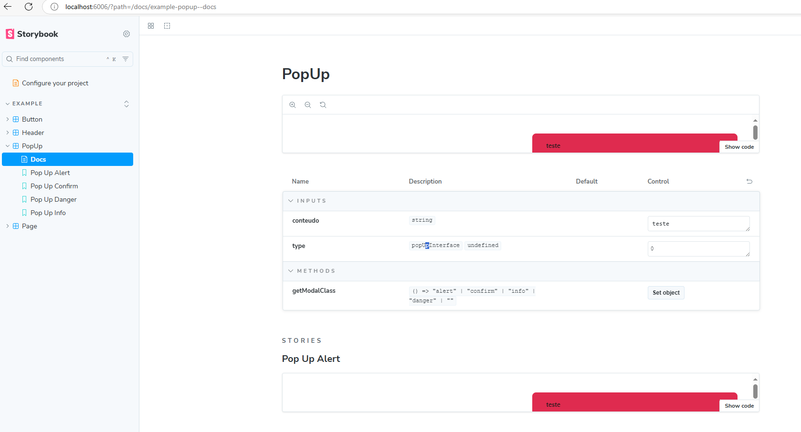
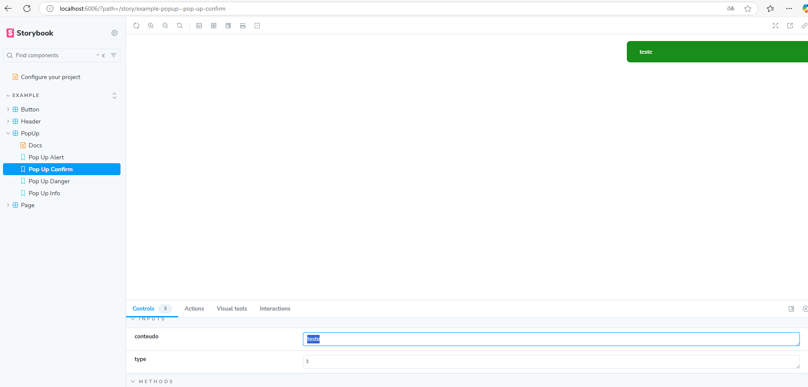
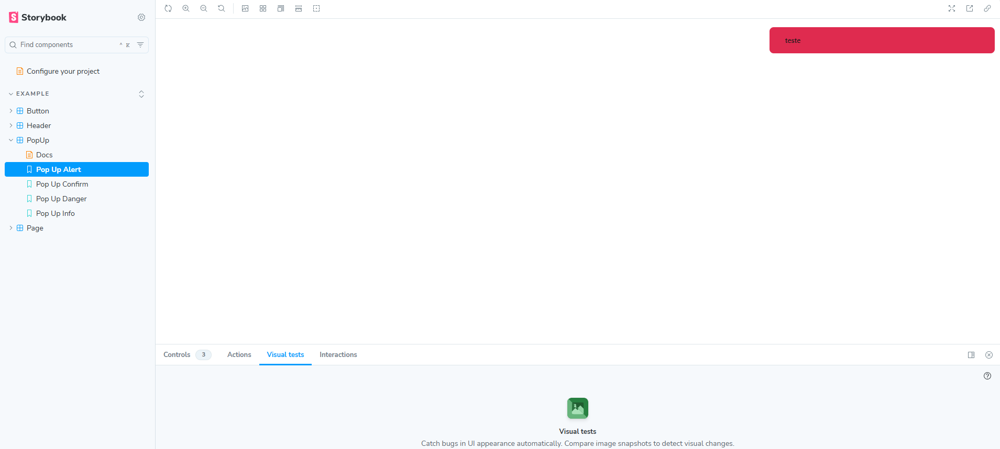

## 1. instalr o storybook
```bash
npx storybook@latest init
```
## 2. inicializar o storybook
```bash
npm run storybookn
```

## 3. storybook build
```bash
npm run build-storybook
```
!


## 4. servir storybook static 
```bash
npx http-server storybook-static
```

# Automação 
## 1.criar a imagem docker 
```bash
    docker build -f dockerfile-storybook -t storybook .
```

## 2.rodar a imagem docker
```bash
    docker run -p 8080:8080 storybook
```

npm install --save-dev chromatic


# AngularStorybookExample

## Development server

To start a local development server, run:

```bash
npm run storybook
```

ou via docker 

```bash
docker-compose up -d
```